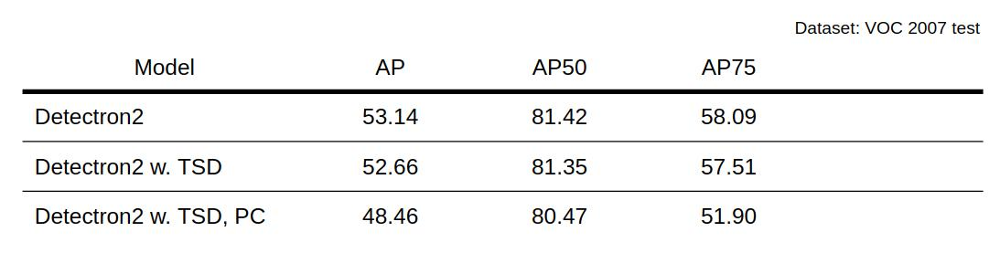

## Implementation
 - TSD, PC
 - Deformable roi pooling(https://github.com/open-mmlab/mmdetection)
 - Backbone Faster-RCNN-FPN-50
 - Set hyper variable as paper does \
   (except base_lr and batch because of gpu)
   
1. TSD, PC \
    a. Add TSDHeads instead ROIHeads(Merged) \
    b. Add Deformation to disentangle regression and classification in TSDHead \
    c. Add DeformableROIPooler for classification in TSDHead \
    d. Add FastRCNNRegressionOutputLayers, FastRCNNClassificationOutputLayers in TSDHead for prediction \
    e. Add progressive constraints on revisit.py
    
2. Deformable ROI Pooling \
    a. Using Deformable ROI Pooling code for classification implemented at /detectron2/layers/csrc
    b. Take original ROI feature as input
    c. First layer is shared with regression
     
3. Hyperparameters \
    a. M_c = M_r = 0.2 \
    b. pooling size  = 7 \
    c. gamma = 0.1

## Dataset
VOC 2007 + VOC 2012
 - Training set: 16551 images
 - Validation set: 4952 images (VOC 2007 only)

## Environment
Ubuntu 18.04 \
Anaconda 4.7.5 \
Pytorch 1.4.0 \
Python 3.8.2 \
CUDA 10.0 \
CUDNN 7.6.3

## Results


## Installation

See [INSTALL.md](INSTALL.md).

## Quick Start

See [GETTING_STARTED.md](GETTING_STARTED.md),
or the [Colab Notebook](https://colab.research.google.com/drive/16jcaJoc6bCFAQ96jDe2HwtXj7BMD_-m5).

Learn more at our [documentation](https://detectron2.readthedocs.org).
And see [projects/](projects/) for some projects that are built on top of detectron2.

### Training & Evaluation in Command Line

We provide a script in "tools/revisit_train_net.py", that is made to train
all the configs provided in revisit.
You may want to use it as a reference to write your own training script for a new research.

To train a model with "revisit_train_net.py", first
setup the corresponding datasets following
[datasets/README.md](https://github.com/facebookresearch/detectron2/blob/master/datasets/README.md),
then run:
```
cd tools/
./revisit_train_net.py --num-gpus 8 \
	--config-file ../configs/PascalVOC-Detection/faster_rcnn_R_50_FPN.yaml
```

The configs are made for 8-GPU training.
To train on 1 GPU, you may need to [change some parameters](https://arxiv.org/abs/1706.02677), e.g.:
```
./revisit_train_net.py \
    --config-file ../configs/PascalVOC-Detection/faster_rcnn_R_50_FPN_1GPU.yaml \
    SOLVER.IMS_PER_BATCH 2 SOLVER.BASE_LR 0.0025
```

For most models, CPU training is not supported.

To evaluate a model's performance, use
```
./revisit_train_net.py \
	--config-file ../configs/PascalVOC-Detection/faster_rcnn_R_50_FPN.yaml \
	--eval-only MODEL.WEIGHTS /path/to/checkpoint_file
```
For more options, see `./revisit_train_net.py -h`.

## License

Detectron2 is released under the [Apache 2.0 license](LICENSE).

## Citing Detectron

If you use Detectron2 in your research or wish to refer to the baseline results published in the [Model Zoo](MODEL_ZOO.md), please use the following BibTeX entry.

```BibTeX
@misc{wu2019detectron2,
  author =       {Yuxin Wu and Alexander Kirillov and Francisco Massa and
                  Wan-Yen Lo and Ross Girshick},
  title =        {Detectron2},
  howpublished = {\url{https://github.com/facebookresearch/detectron2}},
  year =         {2019}
}
```
